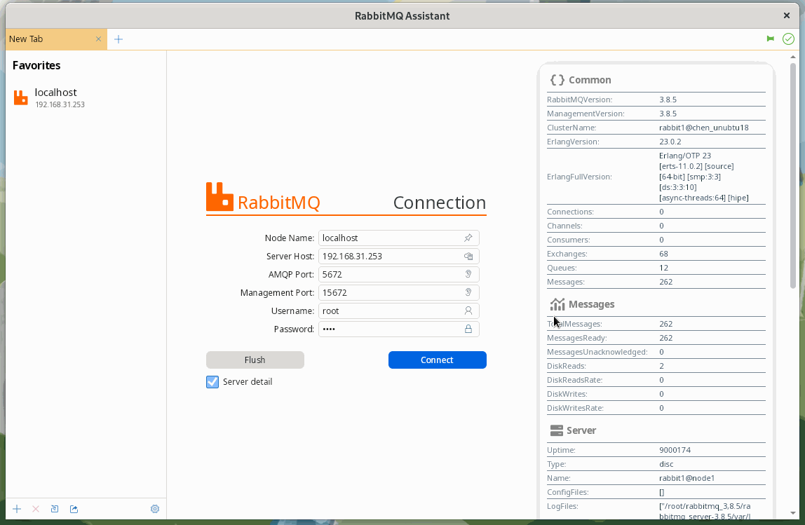

## Support

- Windows 7 and higher
- macOS High Sierra 10.13 and higher
- Debian 9 (Stretch) and higher
- Ubuntu 16.04 and higher
- Fedora 30 and higher

## Download
[**Windows**](https://github.com/chenjing1294/rabbitmq-assistant-release/releases)
&emsp;[**macOS**](https://github.com/chenjing1294/rabbitmq-assistant-release/releases)
&emsp;[**Linux**](https://github.com/chenjing1294/rabbitmq-assistant-release/releases)

## 安装

**macOS**

Download the latest .dmg package and double-click to install it.

**Linux**

Download the latest tarball, then

- Decompress the compressed package: `tar -zxvf RMQA-1.0.8.0-linux-x64.tar.gz`
- Set the language environment (or omit this step may cause the software to start an error): `export LANG=en_US.UTF-8`
- Run: `./RMQA-1.0.8.0-linux-x64/RabbitMQAssistant`

## Common Problem

- An error was reported about the installation of the Mac version: "It is damaged and cannot be opened. You should launch the disk image", because the current version is not signed and is blocked by Mac [GateKeeper](https://support.apple.com/zh-cn/ guide/security/sec5599b66df/web) mechanism interception. Temporarily disable Getkeeper (after installing it) by following these steps:

    1. Select "Anywhere" in "System Preferences" -> "Security & Privacy"; if your system does not have this option, open this settings page again after executing the following command in the terminal, and check "Anywhere":`sudo spctl --master-disable`
    1. Double-click to install RabbitMQ Assistant.

    1. After the installation is complete, you should restore your previous settings, this will protect your Mac from malware, turn on Getkeeper with the following command: `sudo spctl --master-enable`

---

- When running the Mac version, an error is reported: "It is damaged and cannot be opened. You should move it to the trash", because the current version is not signed and is blocked by Mac [GateKeeper](https://support.apple.com/zh -cn/guide/security/sec5599b66df/web) mechanism interception; open the terminal and enter the following command to release the isolation of RabbitMQ Assistant: `sudo xattr -rd com.apple.quarantine /Applications/RabbitMQ\ Assistant.app`

---

- When opening the Linux version, an error is reported: "Unhandled exception. System.InvalidOperationException: Default font family name can't be null or empty." You need to set the locale before running: `export LANG=en_US.UTF-8`
, then run again:`./RMQA-1.0.8.0-linux-x64/RabbitMQAssistant`

## Screenshot

### macOS

### Linux

